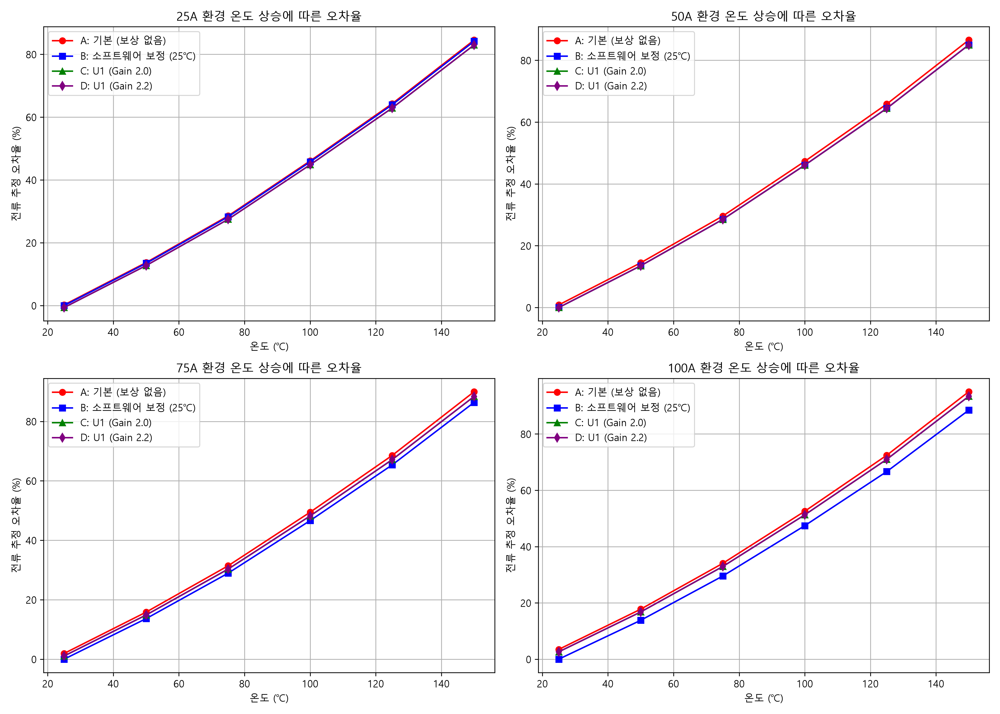

# MOSFET 전류 센싱 온도 보상 및 오차율 분석 보고서

## 1. 개요
본 문서는 25A ~ 100A의 부하 전류 환경에서 온도가 상승(25℃ ~ 150℃)할 때 발생하는 전류 추정 오차를 4가지 방식으로 시뮬레이션하고 비교 분석한 결과입니다.

## 2. 비교군 (Test Cases)
* **Case A (기본 - Red):** 온도 보상이 전혀 적용되지 않은 원본 모스펫 센싱 데이터
* **Case B (소프트웨어 보정 - Blue):** 25℃ 환경을 영점(Zero-point)으로 맞춘 단순 수식 보정
* **Case C (U1 보정 Gain 2.0 - Green):** U1 증폭기(이득 2.0)의 실제 하드웨어 출력을 반영한 오차율
* **Case D (U1 보정 Gain 2.2 - Purple):** U1 증폭기(이득 2.2)의 실제 하드웨어 출력을 반영한 오차율

## 3. 분석 결과 그래프

## 4. 그래프 요약
1. **소프트웨어 캘리브레이션 (Case B):** 테스트된 4가지 방식 중, 25℃를 영점(Zero-point)으로 맞추어 수식으로 보정한 소프트웨어 캘리브레이션(Case B)의 오차율이 가장 낮게 유지되는 것을 확인했습니다.
2. **단순 증폭 회로의 한계 (Case C, D):** U1 하드웨어 회로 데이터를 적용한 Case C(Gain 2.0)와 Case D(Gain 2.2)는 센싱된 신호의 크기만 증폭시켰을 뿐, 온도 상승에 따른 MOSFET 자체의 특성 변화를 보상하지는 못했습니다. 그 결과, 기본 상태인 Case A와 오차율 추이가 거의 동일하게 나타났습니다.