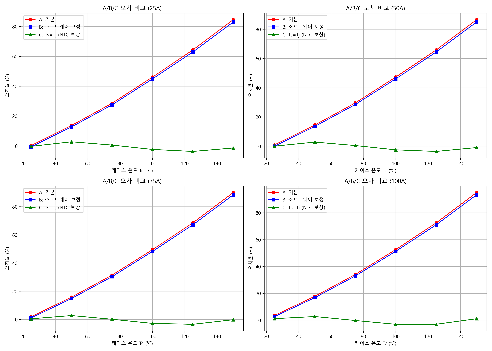
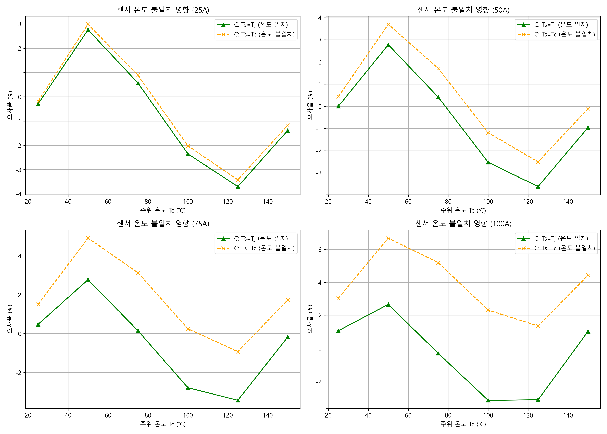

# MOSFET 전류센싱 온도보상 결과 분석

## 1. 시험 개요

MOSFET의 RDS(on)은 온도에 따라 변하므로,
25°C 기준 저항만 사용해 전류를 환산하면 오차가 발생한다.

본 시험에서는 U1 증폭 회로, NTC 저항망, U2 버퍼를 구성하고,
기준점 Calibration을 적용하여 전류 추정 오차를 비교하였다.

전류 25·50·75·100 A와 케이스 온도
25·50·75·100·125·150°C를 조합한 24개 조건을 사용하였다.

Python 모델로 계산한 VDS를 LTspice의 DC 입력으로 사용했으며,
실제 하드웨어 측정 결과는 아니다.

## 2. 비교 방식

| 방식 | 사용 출력 | 처리 방법 |
|---|---|---|
| A | V_pre | U1 명목 이득 2와 기준 저항 1.49 mΩ으로 환산 |
| B | V_pre | 50 A, Tc=25°C 기준점에서 이득 보정 |
| C, Ts=Tj | V_final | NTC 보상 후 기준점 보정 |
| C, Ts=Tc | V_final | 센서온도만 변경하고 Ts=Tj의 보정 계수 재사용 |

Tc는 케이스 온도, Tj는 접합온도, Ts는 NTC 센서온도이다.

Ts=Tj는 센서가 접합온도를 정확히 따른다는 이상적인 조건이다.
Ts=Tc는 센서가 케이스 온도를 따른다는 조건이다.

두 시험에서 MOSFET의 전류·Tc·Tj·VDS는 동일하게 유지했다.

## 3. 최종 성능

보정 기준점인 50 A, Tc=25°C를 제외한
23개 조건의 결과이다.

| 방식 | 평균 절대오차 | 최대 절대오차 | 최대 절대 상대오차 |
|---|---:|---:|---:|
| A | 28.24 A | 95.03 A | 95.03% |
| B | 27.48 A | 93.39 A | 93.39% |
| C, Ts=Tj | 1.15 A | 3.11 A | 3.70% |
| C, Ts=Tc | 1.73 A | 6.68 A | 6.68% |

최대오차 발생 조건:

| 방식 | 최대 A 오차 발생 조건 | 최대 % 오차 발생 조건 |
|---|---|---|
| A | 100 A, Tc=150°C | 100 A, Tc=150°C |
| B | 100 A, Tc=150°C | 100 A, Tc=150°C |
| C, Ts=Tj | 100 A, Tc=100°C | 25 A, Tc=125°C |
| C, Ts=Tc | 100 A, Tc=50°C | 100 A, Tc=50°C |

최대 A 오차와 최대 % 오차는 서로 다른 조건에서 발생할 수 있다.

## 4. NTC 온도보상 효과

기준점 보정만 적용한 B에서는 최대 절대 상대오차가 93.39%로,
온도 상승에 따른 오차가 크게 남았다.

한 기준점에서 구한 일정한 배율만으로는 온도에 따라 변하는
MOSFET 저항을 충분히 보상하기 어렵기 때문이다.

NTC 저항망과 Calibration을 함께 적용한 Ts=Tj 조건에서는
최대 절대 상대오차가 3.70%로 감소하였다.

현재 시험 범위에서 온도에 따른 NTC 저항망의 전달 비율 변화가
MOSFET 저항 상승으로 발생하는 전류 추정 오차를 줄임을 확인하였다.

U1의 2배 증폭 정확도와 최종 전류 추정 정확도는 다른 지표이다.
U1이 정확하게 증폭하더라도 온도에 따른 MOSFET 저항 변화가
보상되지 않으면 전류 추정 오차는 크게 남을 수 있다.

## 5. 센서온도 불일치 영향

Ts=Tc 조건에서는 Ts=Tj에서 구한 보정 계수를 그대로 적용하였다.

평균 절대오차는 1.15 A에서 1.73 A로,
최대 절대 상대오차는 3.70%에서 6.68%로 증가하였다.

이는 센서온도와 MOSFET 접합온도 사이의 차이가
온도보상 정확도에 영향을 준다는 것을 보여준다.

다만 일부 조건에서는 온도 불일치의 영향이 기존 오차와 상쇄되어
절대오차가 감소하기도 한다.
따라서 개별 조건과 전체 평균·최대오차를 함께 평가하였다.

## 6. 적용 범위와 한계

- 데이터시트 기반 모델과 LTspice를 이용한 정상상태 DC 결과이다.
- 모델에 사용한 온도별 저항 곡선을 여러 전류 조건에 적용했다.
- Ts=Tj는 실제 센서 배치로 항상 달성되는 조건이 아니다.
- Ts=Tc 시험은 정상상태 온도 차이의 영향이며, 동적 지연 시험이 아니다.
- 실제 하드웨어 측정과 스위칭 과도현상은 포함하지 않았다.
- 실제 MOSFET 개체별 저항 편차와 NTC·저항 허용오차 전반을 검증하지 않았다.
- U1 입력 오프셋은 별도 보완 시험으로 진행 중이며 위 수치에 포함하지 않았다.

## 7. 결과 파일

- ../data/processed/integrated_24case_outputs.csv
- ../data/processed/integrated_24case_outputs_ts_tc.csv
- ../results/tables/abc_24case_comparison.csv
- ../results/tables/sensor_temperature_comparison.csv
- ../results/tables/calibration_coefficients.json

분석 코드: ../analysis/calibration.py

검증 및 해석 노트북:
../notebooks/04_integrated_sensing_validation.ipynb